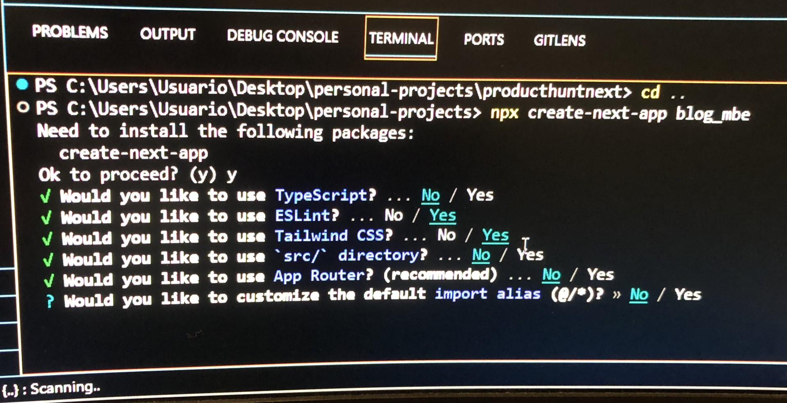

# Notas sobre Blog-mbe

1.- Inicio: Martes 13-02-2024
2.- Esta creado con Next.js 14.1.0, tailwind y prisma.
3.- tiene una base de datos creada en mysql llamada ordermanagerdb.

### Pasos:

1. Se inició la creación desde consola con:

`npx create-next-app order-manager-despensa`

para este proyecto segui la configuración inicial de la imagen.

2. Ya que se uso tailwind preconfigurado se debe considerar:

* tailwind.config.js queda igual.
* postcss.config.js queda igual.
* En el archivo global.css solo debe quedar:

`@tailwind base;
@tailwind components;
@tailwind utilities;`
 
* El archivo global.css debe ser importado en app.js

*En el archivo tailwind.config.js hay que asegurarse que este agregado todos estos archivos:

`
  content: [
    "./pages/**/*.{js,ts,jsx,tsx,mdx}",
    "./components/**/*.{js,ts,jsx,tsx,mdx}",
    "./layout/**/*.{js,ts,jsx,tsx,mdx}",
    "./app/**/*.{js,ts,jsx,tsx,mdx}",
  ],
`
